<div align="center">

# 🏭 MTP Gateway

### Bridge Your Legacy PLCs to Industry 4.0

[](https://github.com/hadijannat/mtp-gateway/actions/workflows/ci.yaml)
[](https://www.python.org/downloads/)
[](https://opensource.org/licenses/MIT)
[](https://github.com/hadijannat/mtp-gateway)
[](https://github.com/hadijannat/mtp-gateway)
[](https://www.vdi.de/richtlinien/details/vdivde-2658-blatt-1-automation-engineering-of-modular-systems-in-the-process-industry-general-concept-and-interfaces)


**Transform your existing factory equipment into Industry 4.0–ready assets with deterministic OPC UA interfaces and AutomationML manifests.**

```mermaid
flowchart LR
    subgraph Southbound["🔌 Your PLCs"]
        M[Modbus TCP/RTU]
        S[Siemens S7]
        E[EtherNet/IP]
        O[OPC UA Client]
    end

    subgraph Gateway["⚙️ MTP Gateway"]
        T[Tag Manager]
        SM[Service Manager]
        Safety[Safety & Interlocks]
    end

    subgraph Northbound["🌐 Modern Systems"]
        UA[OPC UA Server]
        AML[AutomationML Manifest]
        NS[NodeSet2 Export]
    end

    M --> Gateway
    S --> Gateway
    E --> Gateway
    O --> Gateway

    Gateway --> UA
    Gateway --> AML
    Gateway --> NS
```



</div>

---

## 📖 What is MTP Gateway?

**Think of MTP Gateway as a universal translator for your factory.**

Your older PLCs (Programmable Logic Controllers) speak different languages—Modbus, Siemens S7, EtherNet/IP. Modern process control systems expect everyone to speak the same language: **OPC UA with MTP (Module Type Package)**.

MTP Gateway sits in the middle and handles the translation automatically. It:

- **Connects** to your existing equipment without modifications
- **Translates** data and commands into industry-standard formats
- **Exposes** your equipment to modern supervisory systems
- **Protects** against unsafe operations with built-in safety rules

### Who Is This For?

| Role | How MTP Gateway Helps |
|------|----------------------|
| 🏭 **Plant Operators** | See all your equipment in one modern interface |
| 🔧 **Controls Engineers** | Add legacy PLCs to new projects without rewiring |
| 🏗️ **System Integrators** | Repeatable, configuration-driven deployments |
| 💻 **Software Teams** | Clean architecture with testable components |

### Key Benefits

- ✅ **No PLC Modifications** — Read from and write to existing equipment as-is
- ✅ **Plug-and-Produce** — Generate MTP packages that POLs import directly
- ✅ **Deterministic** — Same configuration always produces same NodeIds
- ✅ **Safe by Design** — Write allowlists, rate limits, and interlock enforcement
- ✅ **Standards Compliant** — Full VDI/VDE/NAMUR 2658 alignment
- ✅ **Open Source** — MIT licensed, customize as needed

---

## ✨ Features at a Glance

<table>
<tr>
<td width="50%" valign="top">

### 🔌 Connect
- **Modbus TCP/RTU** — Industrial standard
- **Siemens S7** — S7-300/400/1200/1500
- **EtherNet/IP** — Allen-Bradley & others
- **OPC UA Client** — Connect to other OPC UA servers

</td>
<td width="50%" valign="top">

### 🌐 Expose
- **OPC UA Server** — MTP-compliant address space
- **AutomationML Manifest** — POL-ready `.aml` files
- **MTP Package** — Complete `.mtp` archives
- **NodeSet2 XML** — For interoperability testing

</td>
</tr>
<tr>
<td width="50%" valign="top">

### 🎛️ Control
- **PackML State Machine** — 17 states, 10 commands
- **Interlock Enforcement** — Block dangerous operations
- **Service Orchestration** — Procedures & parameters
- **Quality Propagation** — Bad PLC data = bad OPC UA quality

</td>
<td width="50%" valign="top">

### 🚀 Deploy
- **Docker** — Production-ready containers
- **Python Package** — `pip install` simplicity
- **CLI Tools** — Generate, validate, probe, run
- **JSON Schema** — IDE autocompletion for configs

</td>
</tr>
</table>

---

## 🚀 Quick Start

### Step 1: Install

```bash
# Option A: pip (recommended for most users)
pip install mtp-gateway

# Option B: Docker
docker pull ghcr.io/hadijannat/mtp-gateway:latest

# Option C: From source
git clone https://github.com/hadijannat/mtp-gateway.git
cd mtp-gateway && pip install -e ".[dev]"
```

### Step 2: Configure

Create `config.yaml`:

```yaml
gateway:
  name: MyPEA
  version: "1.0.0"

connectors:
  - name: plc1
    type: modbus_tcp
    host: 192.168.1.100
    port: 502

tags:
  - name: temperature
    connector: plc1
    address: "40001"
    datatype: float32

mtp:
  data_assemblies:
    - name: TempSensor
      type: AnaView
      bindings:
        V: temperature
```

### Step 3: Run

```bash
# Validate your configuration first
mtp-gateway validate config.yaml

# Start the gateway
mtp-gateway run config.yaml

# Your OPC UA server is now available at opc.tcp://localhost:4840
```

---

## 🎬 Demo: Reactor Dosing (Non‑Technical Walkthrough)

**Scenario:** A legacy reactor skid already running in production needs to be integrated into a modern orchestration system—without touching the PLC program. The gateway sits in front of the PLC, exposes a clean OPC UA interface, and generates an MTP package that a process orchestration layer can import.


### What a non‑technical viewer sees

- **Before:** A reactor skid with temperature, pressure, and a dosing pump that only the PLC understands.
- **After:** A clean, standardized module that appears in the orchestration system as a plug‑and‑produce asset.
- **Safety:** Commands are rate‑limited and allow‑listed, with safe‑state behavior on comm loss.

### 3‑minute live demo (no PLC changes)

```bash
# 1) Validate the reactor demo config
mtp-gateway validate examples/reactor-pea.yaml

# 2) Generate the MTP package for import
mtp-gateway generate-manifest examples/reactor-pea.yaml --out ./demo.mtp

# 3) Run the gateway (connects to the configured PLC host)
mtp-gateway run examples/reactor-pea.yaml
```

**Demo highlights to call out:**
- The `.mtp` package is created in seconds and is ready to import.
- The OPC UA endpoint exposes live values and commands with deterministic NodeIds.
- If the PLC goes offline, the gateway switches to safe behavior automatically.

---

## 🏗️ Architecture

MTP Gateway follows a clean three-layer architecture that separates concerns and enables testing:


<p align="center"><em>Three-layer hexagonal architecture: Northbound (OPC UA/AutomationML), Application Core (business logic), Southbound (protocol drivers)</em></p>


### Layer Responsibilities

| Layer | Purpose | Key Components |
|-------|---------|----------------|
| **Northbound** | Expose data to supervisory systems | OPC UA Server, Manifest & NodeSet generators |
| **Application** | Business logic and orchestration | TagManager, ServiceManager, Safety, Interlocks |
| **Southbound** | Communicate with physical devices | Protocol-specific drivers (Modbus, S7, EIP, OPC UA) |

---

## 📡 Protocol Support


<p align="center"><em>Four industrial protocols converge into a unified Tag Manager for seamless data access</em></p>

| Protocol | Status | Extra Install | Example Connection |
|----------|--------|---------------|-------------------|
| Modbus TCP | ✅ Stable | Included | `host: 192.168.1.100` `port: 502` |
| Modbus RTU | ✅ Stable | Included | `serial_port: /dev/ttyUSB0` |
| Siemens S7 | ✅ Stable | `pip install .[s7]` | `host: 192.168.1.50` `rack: 0` `slot: 1` |
| EtherNet/IP | ✅ Stable | `pip install .[eip]` | `host: 192.168.1.60` |
| OPC UA Client | ✅ Stable | Included | `endpoint: opc.tcp://server:4840` |

### Connector Examples

<details>
<summary>📋 Click to expand connector configuration examples</summary>

```yaml
connectors:
  # Modbus TCP
  - name: modbus_plc
    type: modbus_tcp
    host: 192.168.1.100
    port: 502
    unit_id: 1
    timeout: 5.0

  # Modbus RTU (Serial)
  - name: modbus_rtu
    type: modbus_rtu
    serial_port: /dev/ttyUSB0
    baudrate: 9600
    parity: N
    stopbits: 1

  # Siemens S7
  - name: siemens_plc
    type: s7
    host: 192.168.1.50
    rack: 0
    slot: 1

  # EtherNet/IP
  - name: ab_plc
    type: ethernet_ip
    host: 192.168.1.60

  # OPC UA Client
  - name: upstream_server
    type: opcua_client
    endpoint: opc.tcp://192.168.1.70:4840
    security_policy: Basic256Sha256
    security_mode: SignAndEncrypt
```

</details>

---

## 🔄 Service Proxy Modes

MTP Gateway supports three proxy modes that determine where the PackML state machine runs:

| Mode | State Machine Location | Best For | Use Case |
|------|----------------------|----------|----------|
| **THIN** | In the PLC | Smart PLCs with built-in state logic | Gateway reads state, writes commands |
| **THICK** | In the Gateway | Legacy PLCs without state machine | Gateway runs full PackML orchestration |
| **HYBRID** | Both (synchronized) | Validation and debugging | Compare PLC state with gateway state |

```yaml
mtp:
  services:
    # THIN: PLC manages state machine
    - name: Dosing
      mode: thin_proxy
      state_cur_tag: dosing_state
      command_op_tag: dosing_cmd

    # THICK: Gateway manages state machine
    - name: Mixing
      mode: thick_proxy
      hooks:
        on_starting: mixing_motor_start
        on_stopping: mixing_motor_stop

    # HYBRID: Both for validation
    - name: Heating
      mode: hybrid_proxy
      state_cur_tag: heating_state
      command_op_tag: heating_cmd
```

---

## 📦 Data Assemblies (VDI 2658-4)


<p align="center"><em>From config.yaml to POL-ready MTP package: automated generation workflow</em></p>

MTP Gateway implements all standard data assembly types from VDI/VDE/NAMUR 2658 Part 4:

<details>
<summary>📋 Click to expand all 14 data assembly types</summary>

### View Types (Read-Only)

| Type | Description | Key Bindings |
|------|-------------|--------------|
| `AnaView` | Analog value display | `V` (value), `VUnit`, `VScaleMin/Max` |
| `BinView` | Binary value display | `V` (value), `VState0/1` |
| `DIntView` | Integer value display | `V` (value), `VUnit` |
| `StringView` | String value display | `V` (value) |

### Service Parameters (Read/Write)

| Type | Description | Key Bindings |
|------|-------------|--------------|
| `AnaServParam` | Analog parameter | `V`, `VOp`, `VExt`, `VMin/VMax` |
| `BinServParam` | Binary parameter | `V`, `VOp`, `VExt` |
| `DIntServParam` | Integer parameter | `V`, `VOp`, `VExt`, `VMin/VMax` |
| `StringServParam` | String parameter | `V`, `VOp`, `VExt` |

### Active Elements (Control)

| Type | Description | Key Bindings |
|------|-------------|--------------|
| `BinVlv` | Binary valve | `Ctrl`, `Fbk`, `SafePos`, `Permit` |
| `AnaVlv` | Analog valve | `Ctrl`, `Fbk`, `Pos`, `SafePos` |
| `BinDrv` | Binary drive | `Ctrl`, `Fbk`, `SafePos`, `Permit` |
| `AnaDrv` | Analog drive | `Ctrl`, `Fbk`, `Speed`, `SafePos` |
| `PIDCtrl` | PID controller | `PV`, `SP`, `Out`, `Kp`, `Ti`, `Td` |

### Monitors (Alarms)

| Type | Description | Key Bindings |
|------|-------------|--------------|
| `AnaMon` | Analog alarm monitor | `V`, `HAL`, `HWL`, `LAL`, `LWL` |
| `BinMon` | Binary alarm monitor | `V`, `Alarm` |

### Example Configuration

```yaml
mtp:
  data_assemblies:
    - name: ReactorTemp
      type: AnaView
      bindings:
        V: reactor_temp
        VUnit: "degC"

    - name: InletValve
      type: BinVlv
      bindings:
        Ctrl: inlet_valve_cmd
        Fbk: inlet_valve_fbk
        SafePos: false
```

</details>

---

## 🔁 PackML State Machine

MTP Gateway implements the ISA-88 / PackML state model with 17 states and 10 commands:


### Commands Reference

| Command | From States | To State | Blocked by Interlock? |
|---------|-------------|----------|----------------------|
| `START` | IDLE | STARTING | ✅ Yes |
| `STOP` | Any running | STOPPING | ❌ No (safety) |
| `ABORT` | Any | ABORTING | ❌ No (safety) |
| `HOLD` | EXECUTE | HOLDING | ✅ Yes |
| `UNHOLD` | HELD | UNHOLDING | ✅ Yes |
| `SUSPEND` | EXECUTE | SUSPENDING | ✅ Yes |
| `UNSUSPEND` | SUSPENDED | UNSUSPENDING | ✅ Yes |
| `RESET` | STOPPED, COMPLETED | RESETTING | ✅ Yes |
| `CLEAR` | ABORTED | CLEARING | ✅ Yes |
| `COMPLETE` | EXECUTE | COMPLETING | ✅ Yes |

### Interlock Enforcement

Interlocks prevent potentially dangerous operations when safety conditions are active:

```yaml
mtp:
  data_assemblies:
    - name: TempAlarm
      type: BinMon
      bindings:
        V: high_temp_alarm

  services:
    - name: Reactor
      interlock_binding: TempAlarm
      # START will be blocked when high_temp_alarm is true
```

> ⚠️ **Safety Note**: `STOP` and `ABORT` commands are **never** blocked by interlocks. This ensures operators can always safely halt operations.

---

## 💻 CLI Reference

MTP Gateway provides a comprehensive command-line interface:

### Core Commands

| Command | Description |
|---------|-------------|
| `mtp-gateway run <config>` | Start the gateway |
| `mtp-gateway validate <config>` | Check configuration for errors |
| `mtp-gateway probe <config>` | Test connectivity to all PLCs |
| `mtp-gateway generate-example` | Create a starter configuration |
| `mtp-gateway version` | Show version information |

### Generation Commands

| Command | Description |
|---------|-------------|
| `mtp-gateway generate-manifest <config> -o file.aml` | Generate AutomationML manifest |
| `mtp-gateway generate-manifest <config> -o file.mtp --package` | Generate MTP package (ZIP) |
| `mtp-gateway generate-nodeset <config> -o file.xml` | Generate NodeSet2 XML |

### Schema Commands

| Command | Description |
|---------|-------------|
| `mtp-gateway schema export -o schema.json` | Export JSON Schema for IDE support |
| `mtp-gateway schema validate <config>` | Validate config against schema |
| `mtp-gateway schema validate <config> --strict` | Include address format validation |
| `mtp-gateway schema version` | Show schema version |

### Security Commands

| Command | Description |
|---------|-------------|
| `mtp-gateway security generate-cert` | Generate self-signed certificate |
| `mtp-gateway security generate-cert --validity 730` | Certificate valid for 2 years |
| `mtp-gateway security check-cert cert.pem` | Check certificate validity |

---

## ⚙️ Configuration

MTP Gateway uses YAML configuration with full JSON Schema support for IDE autocompletion.

<details>
<summary>📋 Click to expand full configuration reference</summary>

```yaml
# Gateway identification
gateway:
  name: Reactor_PEA_01          # Unique identifier
  version: "1.0.0"              # Semantic version
  vendor: Acme Corp             # Optional vendor name
  vendor_url: https://acme.com  # Optional vendor URL

# OPC UA server settings
opcua:
  endpoint: opc.tcp://0.0.0.0:4840
  namespace_uri: urn:example:reactor-pea
  security:
    allow_none: false           # Require secure connections
    cert_path: ./certs/cert.pem
    key_path: ./certs/key.pem
    policies:
      - Basic256Sha256
      - Aes128_Sha256_RsaOaep

# PLC connections
connectors:
  - name: reactor_plc
    type: modbus_tcp
    host: 192.168.1.100
    port: 502
    poll_rate: 100              # Milliseconds
    timeout: 5.0                # Seconds
    retry_count: 3

# Tag definitions
tags:
  - name: reactor_temp
    connector: reactor_plc
    address: "40001"
    datatype: float32
    byte_order: big
    word_order: big
    unit: degC
    description: "Reactor temperature"

  - name: dosing_cmd
    connector: reactor_plc
    address: "40100"
    datatype: uint16
    writable: true

# MTP structure
mtp:
  data_assemblies:
    - name: TempSensor_Reactor
      type: AnaView
      bindings:
        V: reactor_temp
        VUnit: degC
        VScaleMin: 0
        VScaleMax: 200

  services:
    - name: Dosing
      mode: thin_proxy
      state_cur_tag: dosing_state
      command_op_tag: dosing_cmd
      procedures:
        - name: StandardDose
          parameters:
            - name: DoseAmount
              data_assembly: DoseAmountParam

# Safety settings
safety:
  write_allowlist:              # Only these tags can be written
    - dosing_cmd
    - heating_setpoint
  rate_limit:
    max_writes_per_second: 10   # Prevent write storms
```

### Environment Variables

| Variable | Description | Default |
|----------|-------------|---------|
| `MTP_LOG_LEVEL` | Logging level (DEBUG, INFO, WARNING, ERROR) | INFO |
| `MTP_LOG_FORMAT` | Log format (console, json) | console |
| `MTP_CONFIG_PATH` | Default configuration path | — |

### IDE Autocompletion

Export the JSON Schema for your IDE:

```bash
mtp-gateway schema export -o mtp-gateway-schema.json
```

Then configure your IDE to use it for YAML files. In VS Code with the YAML extension:

```json
{
  "yaml.schemas": {
    "./mtp-gateway-schema.json": "config*.yaml"
  }
}
```

</details>

---

## 🔐 Security


<p align="center"><em>Multi-layer safety: Allowlist → Rate Limit → Interlock checks with safe-state fallback on comm loss</em></p>

MTP Gateway includes comprehensive security features:

### OPC UA Security

- **Security Policies**: Basic256Sha256, Aes128_Sha256_RsaOaep, Aes256_Sha256_RsaPss
- **Security Modes**: Sign, SignAndEncrypt
- **Certificate Management**: Built-in certificate generation and validation

```bash
# Generate a self-signed certificate
mtp-gateway security generate-cert \
  --common-name "My-MTP-Gateway" \
  --organization "Acme Corp" \
  --validity 365 \
  --dns localhost gateway.local \
  --ip 192.168.1.10
```

### Write Protection

- **Allowlists**: Only explicitly permitted tags can be written
- **Rate Limiting**: Prevent write storms and denial-of-service
- **Quality Propagation**: Bad PLC data quality propagates to OPC UA

```yaml
safety:
  write_allowlist:
    - motor_speed_setpoint
    - valve_position_cmd
  rate_limit:
    max_writes_per_second: 10
```

### Audit Logging

All operations are logged with timestamps, sources, and outcomes for compliance and debugging.

---

## 🐳 Deployment

### Docker (Recommended)

```bash
# Pull the image
docker pull ghcr.io/hadijannat/mtp-gateway:latest

# Run with your configuration
docker run -d \
  --name mtp-gateway \
  -p 4840:4840 \
  -v $(pwd)/config.yaml:/config/config.yaml:ro \
  -v $(pwd)/certs:/certs:ro \
  ghcr.io/hadijannat/mtp-gateway:latest
```

<details>
<summary>📋 Click for docker-compose.yaml example</summary>

```yaml
version: '3.8'

services:
  mtp-gateway:
    image: ghcr.io/hadijannat/mtp-gateway:latest
    container_name: mtp-gateway
    restart: unless-stopped
    ports:
      - "4840:4840"
    volumes:
      - ./config.yaml:/config/config.yaml:ro
      - ./certs:/certs:ro
    environment:
      - MTP_LOG_LEVEL=INFO
      - MTP_LOG_FORMAT=json
    healthcheck:
      test: ["CMD", "mtp-gateway", "version"]
      interval: 30s
      timeout: 10s
      retries: 3
```

</details>

### Python Package

```bash
# Install from PyPI
pip install mtp-gateway

# Install with optional protocol support
pip install mtp-gateway[s7]      # Add Siemens S7
pip install mtp-gateway[eip]     # Add EtherNet/IP
pip install mtp-gateway[all]     # All protocols
```

### Development Setup

```bash
git clone https://github.com/hadijannat/mtp-gateway.git
cd mtp-gateway

python -m venv .venv
source .venv/bin/activate  # On Windows: .venv\Scripts\activate

pip install -e ".[dev]"

# Run tests
pytest tests/unit/ -v

# Format and lint
ruff format src/ tests/
ruff check src/ tests/
mypy src/
```

---

## 📜 Standards Compliance

MTP Gateway implements the **VDI/VDE/NAMUR 2658** standard series for Module Type Packages:

| Standard | Topic | Implementation |
|----------|-------|----------------|
| VDI 2658-1 | General Concept | Architecture & lifecycle |
| VDI 2658-2 | MTP Interface | OPC UA address space |
| VDI 2658-3 | Process Functions | PackML state machine |
| VDI 2658-4 | Data Assemblies | All 14 standard types |
| VDI 2658-5 | Services | Procedures & parameters |

### Industry 4.0 Context

MTP (Module Type Package) enables **plug-and-produce** in modular process plants:

1. **Module suppliers** describe their equipment with MTP
2. **Plant builders** import MTPs into their Process Orchestration Layer (POL)
3. **Operations** run the entire plant from a unified interface

MTP Gateway brings this capability to **existing brownfield equipment** without hardware modifications.

---

## 🤝 Contributing

We welcome contributions! See our development workflow:

```bash
# Fork and clone the repository
git clone https://github.com/YOUR_USERNAME/mtp-gateway.git
cd mtp-gateway

# Create a virtual environment
python -m venv .venv
source .venv/bin/activate

# Install development dependencies
pip install -e ".[dev]"

# Run pre-commit hooks
pre-commit install
pre-commit run --all-files

# Run tests
pytest tests/unit/ -v

# Check types
mypy src/
```

### Testing

```bash
# All tests
pytest -v

# Unit tests only
pytest tests/unit/ -v

# Single test file
pytest tests/unit/test_interlocks.py -v

# With coverage
pytest --cov=src/mtp_gateway tests/unit/
```

---

## 📄 License

MTP Gateway is released under the **MIT License**.

```
MIT License

Copyright (c) 2024 Hadijannat

Permission is hereby granted, free of charge, to any person obtaining a copy
of this software and associated documentation files (the "Software"), to deal
in the Software without restriction, including without limitation the rights
to use, copy, modify, merge, publish, distribute, sublicense, and/or sell
copies of the Software, and to permit persons to whom the Software is
furnished to do so, subject to the following conditions:

The above copyright notice and this permission notice shall be included in all
copies or substantial portions of the Software.

THE SOFTWARE IS PROVIDED "AS IS", WITHOUT WARRANTY OF ANY KIND, EXPRESS OR
IMPLIED, INCLUDING BUT NOT LIMITED TO THE WARRANTIES OF MERCHANTABILITY,
FITNESS FOR A PARTICULAR PURPOSE AND NONINFRINGEMENT. IN NO EVENT SHALL THE
AUTHORS OR COPYRIGHT HOLDERS BE LIABLE FOR ANY CLAIM, DAMAGES OR OTHER
LIABILITY, WHETHER IN AN ACTION OF CONTRACT, TORT OR OTHERWISE, ARISING FROM,
OUT OF OR IN CONNECTION WITH THE SOFTWARE OR THE USE OR OTHER DEALINGS IN THE
SOFTWARE.
```

---

<div align="center">

**[Documentation](https://github.com/hadijannat/mtp-gateway/wiki)** •
**[Issues](https://github.com/hadijannat/mtp-gateway/issues)** •
**[Discussions](https://github.com/hadijannat/mtp-gateway/discussions)**

Made with ❤️ for industrial automation

</div>
